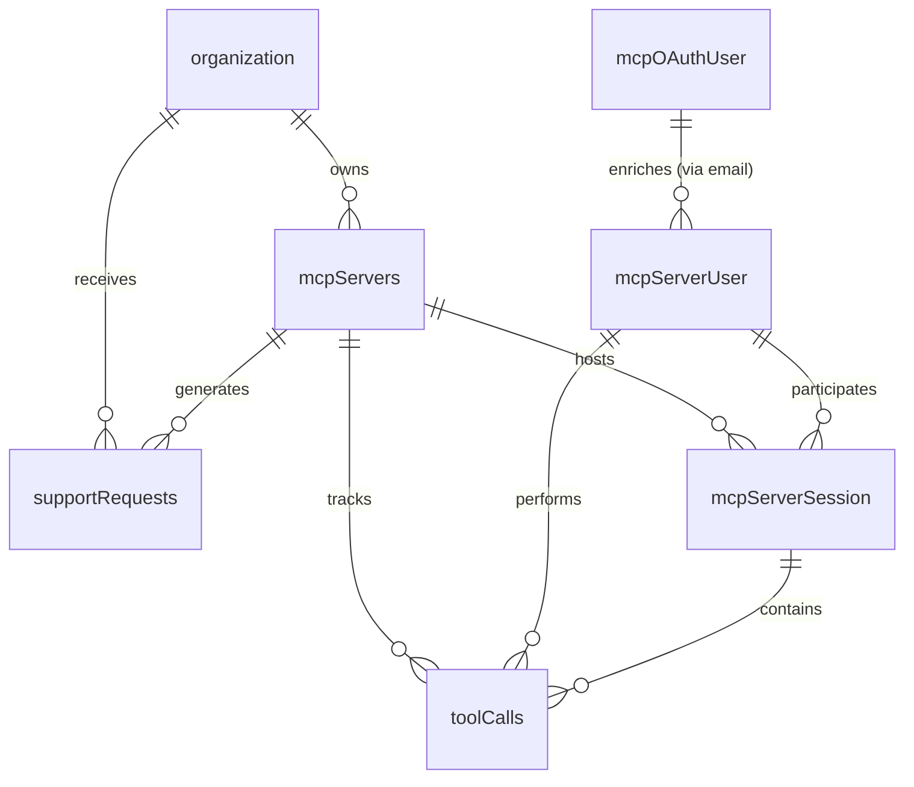

# MCPlatform Database Schema Relationships & Implementation Guide

## Overview

This document provides a comprehensive analysis of the database schema relationships and implementation patterns in MCPlatform, focusing on the core tables that track user sessions, tool calls, and support requests.

## Database Schema Architecture

### Core Table Relationships



### Table Definitions & Relationships

#### 1. `mcpServers` (Central Hub)
**Purpose**: Core configuration for MCP servers hosted by customer organizations

```typescript
{
    id: text (PK) // nanoid(8)
    organizationId: text (FK → organization.id, CASCADE DELETE)
    slug: text (UNIQUE) // Used for vhost-based routing
    name: text
    productPlatformOrTool: text
    oauthIssuerUrl: text
    authType: mcpServerAuthType
    supportTicketType: supportRequestMethod
    createdAt: bigint
}
```

**Key Relationships**:
- **Parent**: `organization` (customer tenant)
- **Children**: `toolCalls`, `supportRequests`, `mcpServerSession`
- **Routing**: Uses `slug` for subdomain-based server identification

#### 2. `mcpServerUser` (End-User Identity)
**Purpose**: Tracks end-users who interact with MCP servers (not platform customers)

```typescript
{
    id: text (PK) // "mcpu_" + nanoid(12)
    trackingId: text (UNIQUE) // Anonymous tracking identifier
    email: text // Links to mcpOAuthUser via email matching
    firstSeenAt: bigint
}
```

**Key Relationships**:
- **No direct FK to mcpServers** - relationship established via sessions
- **Enriched by**: `mcpOAuthUser` (LEFT JOIN on email)
- **Children**: `toolCalls`, `mcpServerSession`

#### 3. `mcpServerSession` (Connection Tracking)
**Purpose**: Tracks individual connection sessions between users and MCP servers

```typescript
{
    mcpServerSessionId: text (PK) // Session identifier
    mcpServerSlug: text (FK → mcpServers.slug, CASCADE DELETE)
    mcpServerUserId: text (FK → mcpServerUser.id, CASCADE DELETE)
    connectionDate: date
    connectionTimestamp: bigint
}
```

**Key Relationships**:
- **Bridge table** connecting users to servers
- **Parent**: `mcpServers` (via slug), `mcpServerUser`
- **Children**: `toolCalls`

#### 4. `toolCalls` (Activity Tracking)
**Purpose**: Records individual tool invocations within MCP sessions

```typescript
{
    id: text (PK) // "tc_" + nanoid(8)
    mcpServerId: text (FK → mcpServers.id)
    mcpServerUserId: text (FK → mcpServerUser.id, CASCADE DELETE)
    mcpServerSessionId: text (FK → mcpServerSession.mcpServerSessionId, CASCADE DELETE)
    toolName: text
    input: jsonb
    output: jsonb
    createdAt: bigint
}
```

**Key Relationships**:
- **Triple-linked**: References server, user, and session
- **Cascade behavior**: Deletes with user or session, but not server

#### 5. `supportRequests` (Support Tickets)
**Purpose**: Customer support tickets submitted by end-users

```typescript
{
    id: text (PK) // "sr_" + nanoid(8)
    organizationId: text (FK → organization.id, CASCADE DELETE)
    mcpServerId: text (FK → mcpServers.id, CASCADE DELETE)
    email: text // String field, not FK - matches users by email
    title: text
    conciseSummary: text
    context: text
    status: supportRequestStatus
    supportRequestMethod: supportRequestMethod
    resolvedAt: bigint
    createdAt: bigint
}
```

**Key Relationships**:
- **Dual-scoped**: Belongs to both organization and specific MCP server
- **Email-based linking**: Connects to users via email string matching

## Dual Authentication Architecture

### Platform Authentication (Customer Access)
- **Tables**: `user`, `session`, `account`, `organization`, `member`, `invitation`
- **Purpose**: Dashboard access for paying customers
- **Schema**: `packages/database/src/auth-schema.ts`
- **Auth Instance**: `packages/dashboard/src/lib/auth/auth.ts`

### MCP OAuth Authentication (End-User Identification)
- **Tables**: `mcpOAuthUser`, `mcpOAuthSession`, `mcpOAuthAccount`, `mcpOAuthApplication`
- **Purpose**: De-anonymize end-users via OAuth flow
- **Schema**: `packages/database/src/mcp-auth-schema.ts`
- **Auth Instance**: `packages/dashboard/src/lib/auth/mcp/auth.ts`
- **Login Page**: `/mcp-oidc/login`

**Critical Separation**: End-users NEVER access the dashboard - they only get identified for tracking purposes.

## Data Fetching Implementation

### Query Patterns & Conventions

#### 1. Organization Scoping
All queries are scoped to the active organization:

```typescript
.where(eq(schema.mcpServers.organizationId, session.session.activeOrganizationId))
```

#### 2. LEFT JOIN for Optional Data Enrichment
```typescript
// Enrich mcpServerUser with OAuth profile data
.leftJoin(mcpOAuthUser, eq(schema.mcpServerUser.email, mcpOAuthUser.email))

// Add server context to tool calls
.leftJoin(schema.mcpServers, eq(schema.toolCalls.mcpServerId, schema.mcpServers.id))
```

#### 3. Multi-Identifier User Lookup
The `getUserData` function supports lookup by ID, tracking ID, or email:

```typescript
.where(or(
    eq(schema.mcpServerUser.id, identifier),
    eq(schema.mcpServerUser.trackingId, identifier),
    eq(schema.mcpServerUser.email, identifier)
))
```

### Core Data Fetching Functions

#### `getUserData(identifier: string)`
**Purpose**: Retrieve user profile with OAuth enrichment

**Query Structure**:
- **Base**: `mcpServerUser`
- **Enrichment**: LEFT JOIN with `mcpOAuthUser` on email
- **Lookup**: Supports ID, trackingId, or email
- **Returns**: Combined user profile with OAuth data

#### `getUserConnections(userId: string)`
**Purpose**: Get user's server connection history

**Query Structure**:
- **Base**: `mcpServerSession`
- **Context**: LEFT JOIN with `mcpServers` for server details
- **Filter**: By `mcpServerUserId`
- **Order**: Most recent connections first
- **Post-filter**: Remove sessions with missing server data

#### `getUserToolCalls(userId: string)`
**Purpose**: Retrieve user's tool usage activity

**Query Structure**:
- **Base**: `toolCalls`
- **Context**: LEFT JOIN with `mcpServers` for server context
- **Filter**: By `mcpServerUserId`
- **Order**: Most recent calls first
- **Data**: Includes input/output JSONB

#### `getUserSupportRequests(email: string)`
**Purpose**: Get support tickets by email

**Query Structure**:
- **Base**: `supportRequests`
- **Context**: LEFT JOIN with `mcpServers` for server context
- **Filter**: By email string matching
- **Order**: Most recent requests first

## UI Implementation Patterns

### React 19 Promise Pattern
The application uses React 19's `use()` hook for efficient data loading:

**Server Component** (creates promises, doesn't await):
```typescript
const userPromise = Promise.resolve(user)
const connectionsPromise = getUserConnections(user.id || '')
const toolCallsPromise = getUserToolCalls(user.id)
const supportRequestsPromise = getUserSupportRequests(user.email || '')
```

**Client Component** (unwraps with `use()`):
```typescript
const user = use(userPromise)
const connections = use(connectionsPromise)
const toolCalls = use(toolCallsPromise)
const supportRequests = use(supportRequestsPromise)
```

### Timeline Event Aggregation
The UI creates a unified activity timeline by:

1. **Event Normalization**: Converting all activities to `TimelineEvent` interface
2. **Deduplication**: Removing duplicate connections by `serverId + createdAt`
3. **Chronological Sorting**: Most recent events first
4. **Interactive Details**: Expandable event information

```typescript
interface TimelineEvent {
    id: string
    type: 'connection' | 'tool_call' | 'support_request'
    timestamp: number
    serverName: string
    serverId: string
    details: any
}
```

## Data Flow Architecture

### 1. Request Routing (VHost-Based)
```
Request: acme-corp.mcplatform.com/api/mcpserver/...
↓
Extract subdomain: "acme-corp"
↓
Query: mcpServers WHERE slug = "acme-corp"
↓
Route to correct server configuration
```

### 2. User Identification Flow
```
Anonymous User (trackingId) 
↓
OAuth Flow (optional)
↓
mcpOAuthUser created
↓
mcpServerUser enriched via email JOIN
```

### 3. Activity Tracking Flow
```
Tool Call Initiated
↓
Create mcpServerSession (if new)
↓
Record toolCalls entry
↓
Link: server + user + session
```

### 4. Support Request Flow
```
User submits support request
↓
Create supportRequests entry
↓
Link: organization + server + email
```

## Performance Considerations

### Indexing Strategy
- **Primary Keys**: All use text with nanoid for distributed systems
- **Foreign Keys**: Proper CASCADE DELETE for data integrity
- **Unique Constraints**: `slug` for routing, `trackingId` for anonymous users

### Query Optimization
- **LEFT JOINs**: Used for optional data enrichment
- **Post-filtering**: Remove null JOINed records in application layer
- **Timestamp Ordering**: Efficient sorting on indexed `createdAt` fields

### Data Integrity
- **Cascade Deletes**: Proper cleanup when organizations/servers are removed
- **Dual Scoping**: Support requests tied to both org and server
- **Email Matching**: Flexible user linking without strict FK constraints

## Migration Considerations

When updating the schema, consider:

1. **Foreign Key Changes**: May require data migration for existing relationships
2. **Cascade Behavior**: Changes affect deletion patterns
3. **Index Updates**: New queries may need additional indexes
4. **UI Query Updates**: Data fetching functions may need modification
5. **Type Safety**: Update TypeScript types after schema changes

## Common Query Patterns

### User Activity Summary
```typescript
// Get user's complete activity across all servers
const activity = await db
    .select({
        toolCallCount: count(toolCalls.id),
        serverCount: countDistinct(mcpServers.id),
        lastActivity: max(toolCalls.createdAt)
    })
    .from(mcpServerUser)
    .leftJoin(toolCalls, eq(mcpServerUser.id, toolCalls.mcpServerUserId))
    .leftJoin(mcpServers, eq(toolCalls.mcpServerId, mcpServers.id))
    .where(eq(mcpServerUser.id, userId))
```

### Server Usage Analytics
```typescript
// Get server usage metrics for organization
const metrics = await db
    .select({
        serverId: mcpServers.id,
        serverName: mcpServers.name,
        userCount: countDistinct(mcpServerUser.id),
        toolCallCount: count(toolCalls.id)
    })
    .from(mcpServers)
    .leftJoin(toolCalls, eq(mcpServers.id, toolCalls.mcpServerId))
    .leftJoin(mcpServerUser, eq(toolCalls.mcpServerUserId, mcpServerUser.id))
    .where(eq(mcpServers.organizationId, organizationId))
    .groupBy(mcpServers.id, mcpServers.name)
```

This architecture provides a robust foundation for tracking user interactions across multiple MCP servers while maintaining clear separation between customer management and end-user analytics.