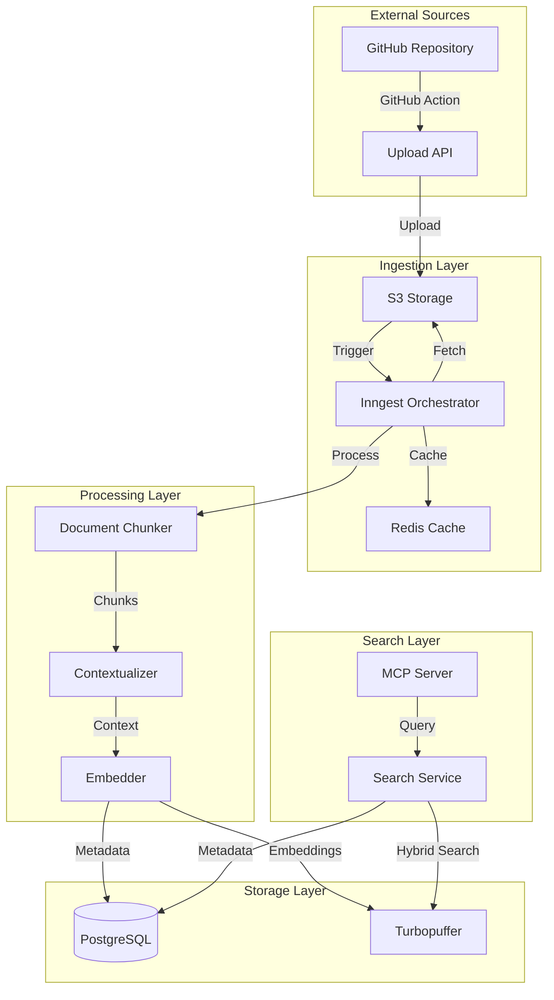
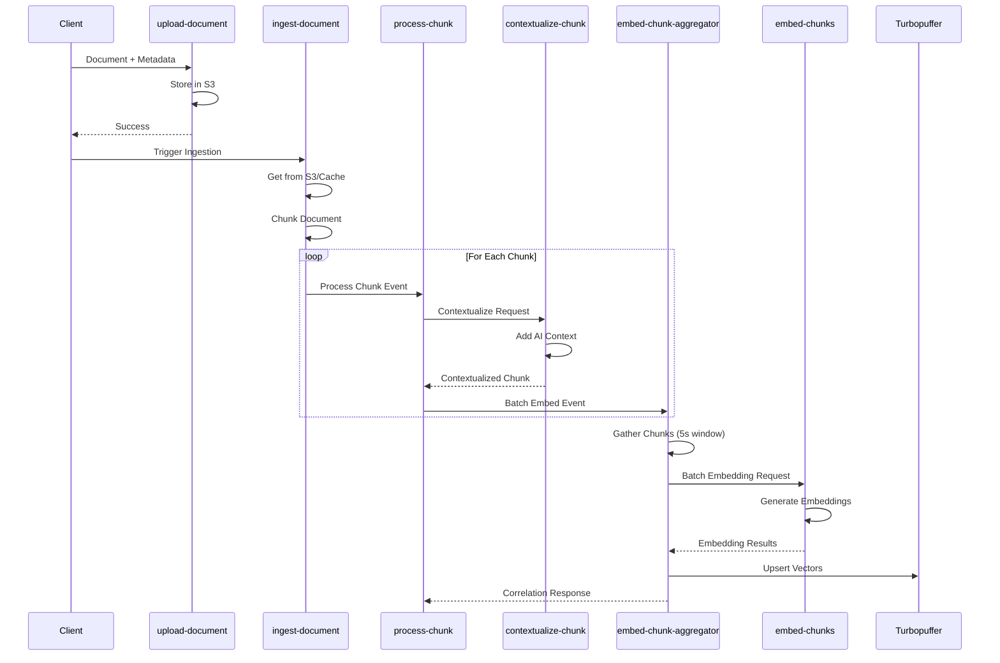
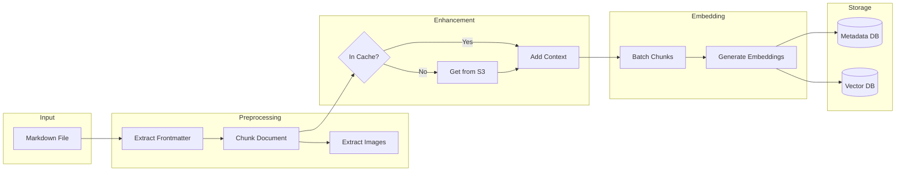
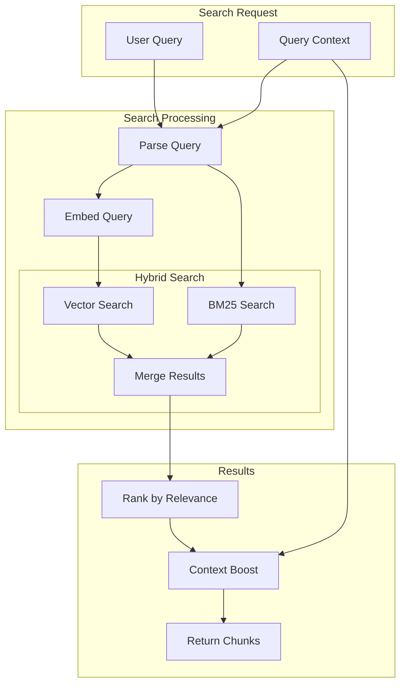
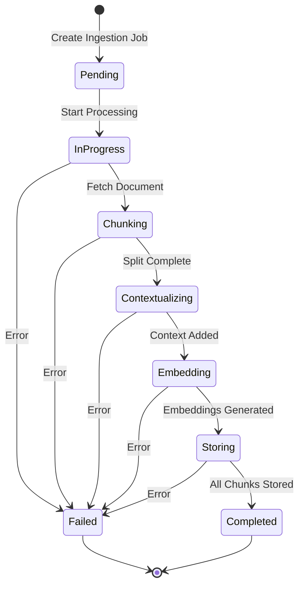
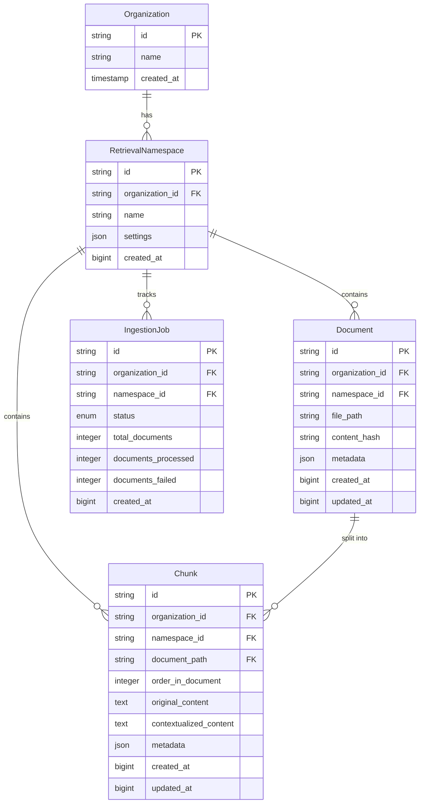
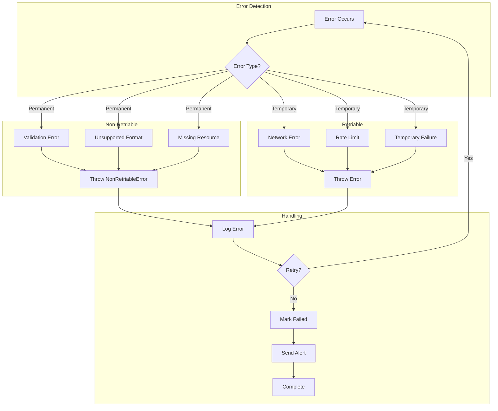
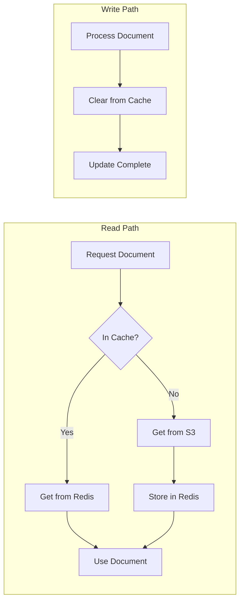
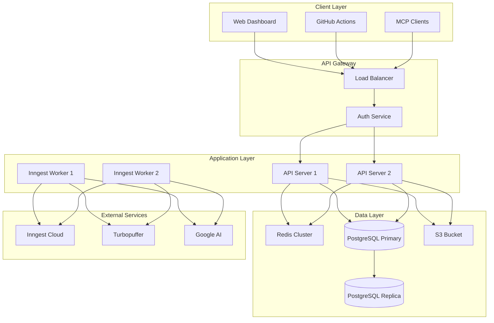

# Retrieval Package Workflow Diagrams

## High-Level Architecture

## Inngest Function Flow

## Document Processing Pipeline

## Search Flow

## State Management

## Data Model Relationships

## Error Handling Flow

## Caching Strategy

## Deployment Architecture

## Performance Optimization Points

```mermaid
graph TD
    subgraph "Optimization Areas"
        BATCH[Batch Processing]
        CACHE[Caching Layer]
        PARALLEL[Parallel Execution]
        INDEX[Database Indexes]
    end

    subgraph "Batch Processing"
        B1[100 chunks per embedding batch]
        B2[5 second gathering window]
        B3[Organization-based batching]
    end

    subgraph "Caching"
        C1[24-hour document cache]
        C2[Skip S3 on cache hit]
        C3[Clear after processing]
    end

    subgraph "Parallelization"
        P1[Concurrent chunk processing]
        P2[Multiple Inngest workers]
        P3[Async S3 operations]
    end

    subgraph "Indexing"
        I1[namespace_id index]
        I2[document_path index]
        I3[Composite unique constraints]
    end

    BATCH --> B1
    BATCH --> B2
    BATCH --> B3
    CACHE --> C1
    CACHE --> C2
    CACHE --> C3
    PARALLEL --> P1
    PARALLEL --> P2
    PARALLEL --> P3
    INDEX --> I1
    INDEX --> I2
    INDEX --> I3
```

These diagrams provide a comprehensive visual representation of the retrieval package's architecture, workflows, and key design decisions. They can be rendered using any Mermaid-compatible viewer or documentation system.